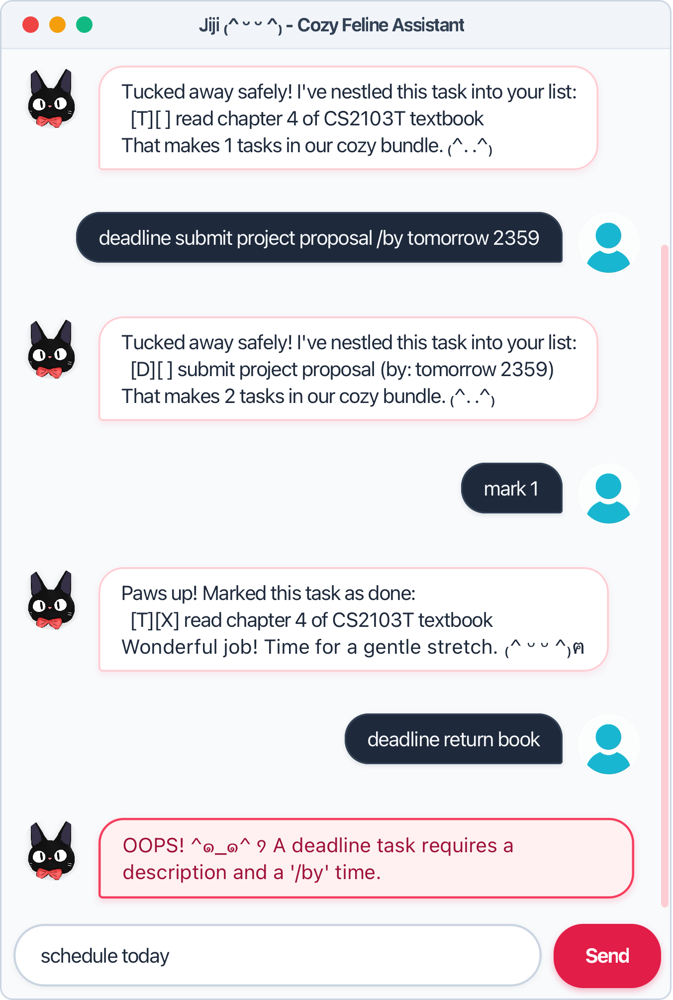

# Jiji User Guide

**Jiji** is a cozy, comforting personal assistant chatbot (featuring both a modern JavaFX GUI and a fast CLI) that helps you organize and manage tasks (ToDos, Deadlines, and Events) with warm feline charm ₍^ ᵕ ᵕ ^₎ฅ.

<p align="center">
  
</p>

---

## Features Summary

| Command | Syntax | Description |
| :--- | :--- | :--- |
| **`todo`** | `todo <description>` | Adds a to-do task. |
| **`deadline`** | `deadline <description> /by <time>` | Adds a task with a deadline. |
| **`event`** | `event <description> /from <start> /to <end>` | Adds an event with start and end times. |
| **`list`** | `list [pending|done]` | Lists all tasks, or filters by pending/done status while preserving indices. |
| **`schedule`** | `schedule <date|today>` | Views tasks scheduled on a specific date while preserving indices. |
| **`mark`** | `mark <task_number>` | Marks a task as completed (`[X]`). |
| **`unmark`** | `unmark <task_number>` | Marks a task as not completed (`[ ]`). |
| **`delete`** | `delete <task_number>` | Removes a task from the list and re-indexes remaining tasks. |
| **`find`** | `find <keyword>` | Finds tasks matching a search keyword. |
| **`stats`** | `stats` | Displays overall task progress, completion rate, and type breakdown. |
| **`help`** | `help [command]` | Displays general guidance or details on a specific command. |
| **`bye`** | `bye` | Exits the Jiji application. |

---

## Command Details

### 1. Adding a ToDo Task: `todo`
Adds a task without any date or time constraints.

* **Format**: `todo <description>`
* **Example**:
  ```text
  todo read book
  ```
* **Expected Output**:
  ```text
      ____________________________________________________________
       Tucked away safely! I've nestled this task into your list:
         [T][ ] read book
       That makes 1 tasks in our cozy bundle. ₍^. .^₎
      ____________________________________________________________
  ```

---

### 2. Adding a Deadline Task: `deadline`
Adds a task that must be completed by a specific date or time. Jiji understands standard date and time formats (e.g. `yyyy-MM-dd`, `d/M/yyyy HHmm`) and displays them in a friendly format (`MMM dd yyyy, h:mma`).

* **Format**: `deadline <description> /by <date/time>`
* **Accepted Formats**:
  * Date: `yyyy-MM-dd` (e.g. `2026-08-30`), `d/M/yyyy` (e.g. `2/12/2026`)
  * Date-Time: `yyyy-MM-dd HHmm` (e.g. `2026-08-30 1800`), `d/M/yyyy HHmm` (e.g. `2/12/2026 1800`)
  * Text descriptions (e.g. `Sunday`) are also supported.
* **Example (Date)**:
  ```text
  deadline return book /by 2026-08-30
  ```
* **Expected Output**:
  ```text
      ____________________________________________________________
       Tucked away safely! I've nestled this task into your list:
         [D][ ] return book (by: Aug 30 2026)
       That makes 2 tasks in our cozy bundle. ₍^. .^₎
      ____________________________________________________________
  ```
* **Example (Date and Time)**:
  ```text
  deadline submit project /by 2/12/2026 1800
  ```
* **Expected Output**:
  ```text
      ____________________________________________________________
       Tucked away safely! I've nestled this task into your list:
         [D][ ] submit project (by: Dec 02 2026, 6:00PM)
       That makes 3 tasks in our cozy bundle. ₍^. .^₎
      ____________________________________________________________
  ```

---

### 3. Adding an Event Task: `event`
Adds an event that occurs over a specific time interval. Both dates and times are formatted for clarity.

* **Format**: `event <description> /from <start> /to <end>`
* **Example**:
  ```text
  event orientation camp /from 2026-09-01 0900 /to 2026-09-03 1700
  ```
* **Expected Output**:
  ```text
      ____________________________________________________________
       Tucked away safely! I've nestled this task into your list:
         [E][ ] orientation camp (from: Sep 01 2026, 9:00AM to: Sep 03 2026, 5:00PM)
       That makes 4 tasks in our cozy bundle. ₍^. .^₎
      ____________________________________________________________
  ```

---

### 4. Listing Tasks: `list`
Displays current tasks along with their 1-based index, type tag (`[T]`, `[D]`, `[E]`), completion status (`[ ]` or `[X]`), and any associated times. You can view all tasks, or filter by pending or completed tasks to keep your view uncluttered. Filtered views preserve original task indices so you can directly mark, unmark, or delete them.

* **Format**: `list [pending|done]`
* **Example (All Tasks)**:
  ```text
  list
  ```
* **Expected Output**:
  ```text
      ____________________________________________________________
       Here are the tasks in your list:
       1.[T][ ] read book
       2.[D][ ] return book (by: Sunday)
       3.[E][ ] project meeting (from: Mon 2pm to: 4pm)
      ____________________________________________________________
  ```
* **Example (Filter Pending Tasks)**:
  ```text
  list pending
  ```
* **Expected Output**:
  ```text
      ____________________________________________________________
       Here are the pending tasks in your list:
       1.[T][ ] read book
       2.[D][ ] return book (by: Sunday)
       3.[E][ ] project meeting (from: Mon 2pm to: 4pm)
      ____________________________________________________________
  ```
* **Example (Filter Completed Tasks)**:
  ```text
  list done
  ```
* **Expected Output**:
  ```text
      ____________________________________________________________
       Here are the completed tasks in your list:
       (or "You have no completed tasks yet.")
      ____________________________________________________________
  ```
---

### 5. Marking a Task as Done: `mark`
Marks the task at the specified 1-based index as completed.

* **Format**: `mark <task_number>`
* **Example**:
  ```text
  mark 2
  ```
* **Expected Output**:
  ```text
      ____________________________________________________________
       Paws up! Marked this task as done:
         [D][X] return book (by: Sunday)
       Wonderful job! Time for a gentle stretch. ₍^ ᵕ ᵕ ^₎ฅ
      ____________________________________________________________
  ```

---

### 6. Marking a Task as Not Done: `unmark`
Marks a previously completed task back as incomplete.

* **Format**: `unmark <task_number>`
* **Example**:
  ```text
  unmark 2
  ```
* **Expected Output**:
  ```text
      ____________________________________________________________
       No hurry at all! I've marked this task as pending again:
         [D][ ] return book (by: Sunday)
       We'll get back to it when you're ready. ₍^. .^₎
      ____________________________________________________________
  ```

---

### 7. Deleting a Task: `delete`
Removes a task from the list at the specified 1-based index and automatically shifts the indices of subsequent tasks.

* **Format**: `delete <task_number>`
* **Example**:
  ```text
  delete 2
  ```
* **Expected Output**:
  ```text
      ____________________________________________________________
       Gently cleared away! I've removed this task:
         [D][ ] return book (by: Sunday)
       That leaves 2 cozy tasks in your list. ₍^. .^₎
      ____________________________________________________________
  ```

---

### 8. Finding Tasks by Keyword: `find`
Searches for tasks whose descriptions contain the given keyword (case-insensitive) and lists all matches.

* **Format**: `find <keyword>`
* **Example**:
  ```text
  find book
  ```
* **Expected Output**:
  ```text
      ____________________________________________________________
       Here are the matching tasks in your list:
       1.[T][ ] read book
       2.[D][ ] return book (by: Sunday)
      ____________________________________________________________
  ```

---

### 9. Viewing Schedules by Date: `schedule`
Displays tasks (deadlines and events) occurring on or due by a specified date. You can provide any standard date format (e.g. `yyyy-MM-dd`, `d/M/yyyy`) or use the keyword `today`. Master 1-based task indices are preserved in the output so you can immediately mark, unmark, or delete scheduled tasks.

* **Format**: `schedule <date|today>`
* **Accepted Formats**: `yyyy-MM-dd` (e.g. `2026-08-30`), `d/M/yyyy` (e.g. `30/8/2026`), or `today`
* **Example (Scheduled Tasks Found)**:
  ```text
  schedule 2026-08-30
  ```
* **Expected Output**:
  ```text
      ____________________________________________________________
       Schedule for Aug 30 2026:
       2.[D][ ] return book (by: Aug 30 2026)
       3.[E][ ] hackathon (from: Aug 30 2026, 10:00AM to: Aug 30 2026, 8:00PM)
      ____________________________________________________________
  ```
* **Example (No Tasks Scheduled)**:
  ```text
  schedule 2026-12-25
  ```
* **Expected Output**:
  ```text
      ____________________________________________________________
       No tasks scheduled for Dec 25 2026. A purr-fectly peaceful day to rest! ₍^ ᵕ ᵕ ^₎
      ____________________________________________________________
  ```

---

### 10. Getting Help: `help`
Displays a guide with all available commands, or detailed syntax and examples for a specified command.

* **Format**: `help [command]`
* **Example (General Help)**:
  ```text
  help
  ```
* **Expected Output**:
  ```text
      ____________________________________________________________
       Available commands in Jiji:

       [Add Tasks]
       • todo <description>
       • deadline <description> /by <time>
       • event <desc> /from <start> /to <end>

       [Manage Tasks]
       • list [filter] - View tasks (pending/done)
       • schedule <date> - View schedule for date
       • mark <index> - Mark as done
       • unmark <index> - Mark as not done
       • delete <index> - Delete a task
       • find <keyword> - Search by keyword

       [General]
       • stats - View task statistics
       • help [command] - View command guide
       • bye - Exit Jiji

       Tip: Type 'help <command>' (e.g. 'help deadline') for details!
      ____________________________________________________________
  ```
* **Example (Command-Specific Help)**:
  ```text
  help deadline
  ```
* **Expected Output**:
  ```text
      ____________________________________________________________
       Command: deadline
       Syntax: deadline <desc> /by <time>
       Description: Adds a task due by a specific date/time.
       Formats: yyyy-MM-dd, d/M/yyyy, HHmm
       Example: deadline submit report /by 2026-08-30 1800
      ____________________________________________________________
  ```

---

### 11. Viewing Task Statistics: `stats`
Displays overall task progress, completion rate percentage, and category breakdown across ToDos, Deadlines, and Events, including overdue deadline detection.

* **Format**: `stats` (or `statistics`)
* **Example**:
  ```text
  stats
  ```
* **Expected Output**:
  ```text
      ____________________________________________________________
       Task Statistics & Insights:

       [Overall Progress]
       • Total tasks: 3
       • Completed: 1 (33.3%)
       • Pending: 2

       [Breakdown by Type]
       • ToDos: 1 (0 completed)
       • Deadlines: 1 (1 completed, 0 overdue)
       • Events: 1 (0 completed)

       Tip: Use 'list pending' to view only incomplete tasks!
      ____________________________________________________________
  ```

---

### 12. Exiting the Application: `bye`
Exits Jiji with a farewell message.

* **Format**: `bye`
* **Expected Output**:
  ```text
      ____________________________________________________________
       Purrs and gentle head-bumps! Rest well and see you soon! ₍^ ᵕ ᵕ ^₎ฅ
      ____________________________________________________________
  ```

---

## Cozy Feline Personality & Statement Variety

Jiji is crafted to be a warm, comforting feline companion throughout your busy day. Inspired by Jiji from *Kiki's Delivery Service*, the chatbot greets you warmly, encourages gentle breaks, and keeps your tasks organized without pressure:

* **Dynamic Statement Bank**: In GUI mode, Jiji draws from an expressive bank of diverse, randomized responses for greetings, task confirmations, completions, deferrals, removals, and farewells. Every interaction feels fresh, caring, and lively!
* **Calm & Stress-Free Tone**: Tasks are framed as a "cozy bundle" or "basket", completed tasks are celebrated with gentle stretches and head-bumps, and unmarked tasks are re-opened with "no hurry at all".
* **Deterministic CLI Mode**: When executing automated test suites or running via CLI, Jiji automatically switches to a canonical statement set to guarantee 100% test reproducibility.

---

## Error Handling & Feline Feedback

Jiji validates your input and provides helpful, friendly error messages using custom feline emoticons:

* **Missing Task Description**:
  ```text
  todo
  ```
  ```text
      ____________________________________________________________
       OOPS! ₍^._.^₎ 𐒡 The description of a todo cannot be empty.
      ____________________________________________________________
  ```

* **Missing Deadline/Event Parameter**:
  ```text
  deadline return book
  ```
  ```text
      ____________________________________________________________
       OOPS! ^๑_๑^ ੭ A deadline task requires a description and a '/by' time.
      ____________________________________________________________
  ```

* **Invalid or Out-of-Bounds Task Number**:
  ```text
  mark 10
  ```
  ```text
      ____________________________________________________________
       OOPS! ₍^› ꘍ ‹ ^₎⟆ Please provide a valid task number.
      ____________________________________________________________
  ```

* **Unrecognized Command**:
  ```text
  blah
  ```
  ```text
      ____________________________________________________________
       OOPS! ₍^› ꘍ ‹ ^₎⟆ I'm sorry, but I don't know what that means.
      ____________________________________________________________
  ```

* **Duplicate Task Detection**:
  Attempting to add a task identical to an existing entry in your list is prevented:
  ```text
  todo read book
  ```
  ```text
      ____________________________________________________________
       OOPS! ₍^. .^₎ This task is already in your list:
         [T][ ] read book
      ____________________________________________________________
  ```

* **Event Chronological Order Validation**:
  Event end dates or times cannot precede start dates or times:
  ```text
  event camp /from 2026-09-03 /to 2026-09-01
  ```
  ```text
      ____________________________________________________________
       OOPS! ^๑_๑^ ੭ Event end date/time cannot be earlier than start date/time.
      ____________________________________________________________
  ```

* **Non-Existent Calendar Dates**:
  Calendar dates with impossible days or months (such as February 30 or April 31) are strictly rejected:
  ```text
  deadline report /by 2026-02-30
  ```
  ```text
      ____________________________________________________________
       OOPS! ₍^› ꘍ ‹ ^₎⟆ That date does not exist on the calendar (e.g. Feb 30). Please provide a valid date.
      ____________________________________________________________
  ```

* **Duplicate Parameter Rejection**:
  Commands with duplicate parameter tokens (such as multiple `/by`, `/from`, or `/to` tags) are rejected with clear guidance:
  ```text
  deadline book /by tomorrow /by Sunday
  ```
  ```text
      ____________________________________________________________
       OOPS! ^๑_๑^ ੭ The parameter '/by' cannot be specified multiple times.
      ____________________________________________________________
  ```

* **Storage Delimiter Protection**:
  The pipe character `|` is reserved for task file persistence and cannot be used in descriptions or parameters:
  ```text
  todo read | book
  ```
  ```text
      ____________________________________________________________
       OOPS! ₍^› ꘍ ‹ ^₎⟆ Task descriptions and parameters cannot contain the '|' character.
      ____________________________________________________________
  ```

* **Zero-Argument Command Enforcement**:
  Supplying unexpected arguments to commands that take none (e.g. `bye` or `stats`) is flagged immediately:
  ```text
  bye now
  ```
  ```text
      ____________________________________________________________
       OOPS! ₍^› ꘍ ‹ ^₎⟆ The 'bye' command does not take any arguments.
      ____________________________________________________________
  ```

---

## Data Persistence

Jiji automatically persists your task list so you never lose track of your items:

* **Automatic Saving**: Every time you add, delete, mark, or unmark a task, Jiji immediately updates the storage file on disk.
* **Storage Location**: Tasks are stored in `data/jiji.txt` relative to the application's root directory. The directory and file are created automatically if they do not exist.
* **Automatic Loading**: When Jiji starts up, it automatically reads `data/jiji.txt` and populates your task list.
* **Storage Format**: Pipe-separated text format:
  ```text
  T | 1 | read book
  D | 0 | return book | Sunday
  E | 0 | project meeting | Mon 2pm | 4pm
  ```

---

## Graphical User Interface (JavaFX GUI)

Jiji features a modern, responsive Graphical User Interface built with JavaFX and FXML:
* **Asymmetric Conversation Design**: User inputs and Jiji's replies are styled distinctly. User commands appear on the right in compact dark slate bubbles, while Jiji's responses appear on the left in clean white card bubbles with warm rose accents.
* **Visual Error Highlighting**: When an unrecognized command or malformed argument is submitted, Jiji's response is styled with a distinct soft rose-red background and crimson border, immediately drawing attention to the issue.
* **Responsive Layout & Text Wrapping**: Resizing the application window dynamically scales the chat container and automatically wraps text bubbles without clipping or awkward overflow.
* **Optimized Avatars & Spacing**: Compact 42×42 px circular avatars eliminate vertical dead space on short commands, keeping chat history dense and readable.
* **Streamlined Input Dock**: Floating pill-shaped text input with active focus retention and hover feedback allows fluid, continuous command entry without re-clicking.
* **Auto-Scrolling**: Automatically scrolls down to the newest message upon receiving input or responses.
* **Dual Execution Mode**: Supports both GUI and text-based CLI seamlessly.

To launch the JavaFX GUI application:
```bash
./gradlew run
```

---

## Building and Running with Gradle

Jiji uses Gradle for build automation, testing, and packaging:

* **Run Jiji in GUI mode (with assertions enabled)**:
  ```bash
  ./gradlew run
  ```
* **Run Jiji in CLI mode (with assertions enabled)**:
  ```bash
  ./gradlew run --args="--cli" --console=plain --quiet
  ```
* **Run automated unit tests (with assertions enabled)**:
  ```bash
  ./gradlew test
  ```
* **Run Checkstyle code style analysis**:
  ```bash
  ./gradlew checkstyleMain checkstyleTest
  ```
* **Build project & assemble distribution**:
  ```bash
  ./gradlew build
  ```

---

## Standalone Executable JAR

You can package and distribute Jiji as a standalone executable fat JAR:

### 1. Generating the JAR File
Run the following Gradle task:
```bash
./gradlew shadowJar
```
The generated executable JAR will be located at:
```text
build/libs/jiji.jar
```

### 2. Running the JAR File
You can run the JAR file on any system with Java 25 installed:
1. Copy `jiji.jar` into your desired working directory.
2. Open a terminal in that folder and run:
   ```bash
   java -jar "jiji.jar"
   ```
3. Jiji will automatically create and persist tasks in `data/jiji.txt` in that folder.

---

## Acknowledgments

* **SE-EDU Initiative**: The foundational JavaFX architecture, FXML controllers, and dialog layout were adapted and extended from the [SE-EDU JavaFX 4 Tutorial](https://se-education.org/guides/tutorials/javaFxPart4.html).
* **CS2103/T Teaching Team**: For the starter codebase template, software engineering guidelines, and automated testing framework.
* **Studio Ghibli**: Inspiration for Jiji's cozy feline personality, character charm, and warmth from *Kiki's Delivery Service*.